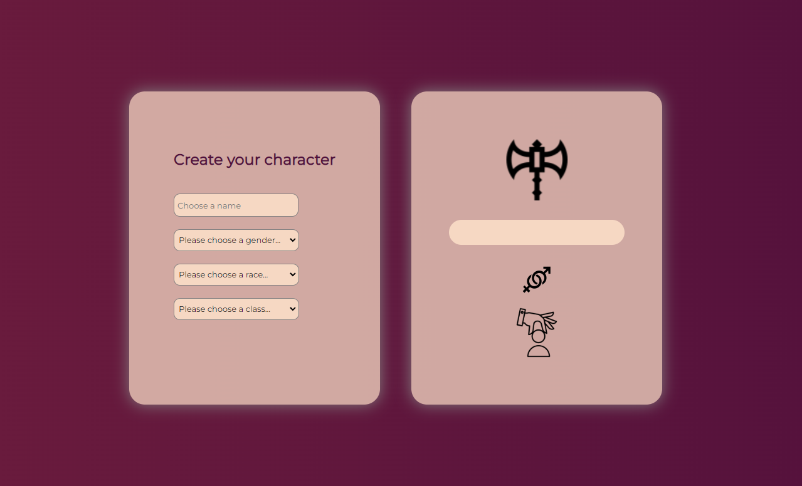

# Create Your Character

Crate Your Character was a project during my studies to learn and practice
- JS DOM manipulations
- *input* event
- dynamic page changing

The entered name will show up on the character card on the right, and choosing gender, race and class will change the relevant images.

## Usage

1. Clone the project

2. Navigate into *backend* folder
```
cd backend
```

3. Run *server.js*
```
node server.js
```

## Preview
